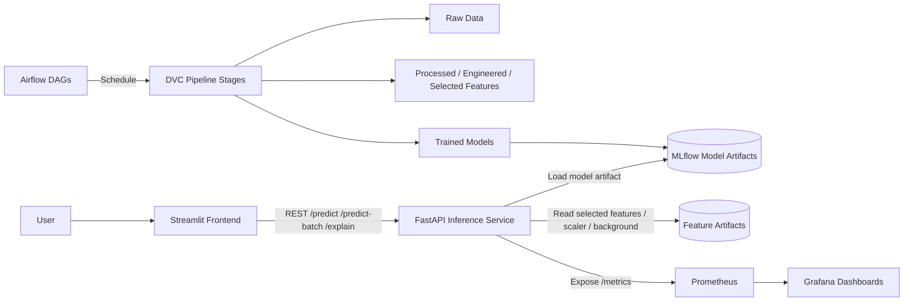

# High-Level Design (HLD)

## 1. System Overview

The project is split into independent software blocks connected via REST APIs and file-based pipeline artifacts:

- **Frontend**: Streamlit UI for prediction, batch scoring, and SHAP explanation.
- **Backend**: FastAPI inference service that loads the deployed MLflow model and exposes REST endpoints.
- **Training Pipeline**: DVC-driven modular pipeline for data processing, feature engineering, feature selection, model training, and evaluation.
- **Orchestration**: Airflow DAGs for scheduled ingestion and retraining workflows.
- **Tracking/Registry**: MLflow for experiment tracking and model artifact versioning.
- **Monitoring**: Prometheus for metrics collection and Grafana for dashboards.

## 2. Loose Coupling Principle

The frontend never imports model code directly. It communicates only with the backend through configurable REST calls using `BACKEND_URL`. This keeps the UI independent from the model inference engine and allows either block to be deployed, scaled, or replaced independently.

## 3. Architecture Diagram

## 4. Runtime Flow

1. Airflow ingests data and triggers DVC pipeline stages.
2. DVC produces processed data, selected features, and trained models.
3. MLflow stores model artifacts and run metadata.
4. FastAPI loads the chosen model and serves predictions.
5. Streamlit calls FastAPI over REST and renders results.
6. Prometheus scrapes `/metrics` from FastAPI.
7. Grafana visualizes request count, latency, and drift.

## 5. Paradigm

The codebase is a hybrid:

- **Functional style** for pipeline stages in `src/data`, `src/features`, and `src/model`.
- **OO style** for the inference service class in `src/api/main.py` and Airflow DAG task objects.

This is appropriate because the pipeline stages are simple transformations, while the inference service benefits from encapsulated state such as feature metadata, scaler stats, and model handles.

## 6. Major Interfaces

- REST API for inference and explainability
- DVC pipeline stages for reproducibility
- Airflow DAG for orchestration
- Prometheus `/metrics` endpoint for monitoring
