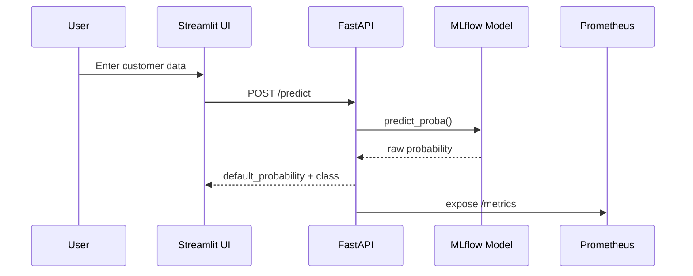

# Low-Level Design (LLD)

## 1. Module-Level Breakdown

### 1.1 `src/data/process.py`

Responsibilities:
- Load and sample raw CSV data
- Create binary target label
- Remove columns with excessive missing values
- Convert date/categorical fields
- Engineer date-based features
- Produce final numeric feature matrix and train/test split artifacts

### 1.2 `src/features/engineer.py`

Responsibilities:
- Compute correlation analysis
- Compute WoE/IV summaries
- Remove highly correlated features
- Engineer derived ratio features
- Drop bulk low-value features

### 1.3 `src/features/selection.py`

Responsibilities:
- Remove leakage-prone features
- Split and scale data
- Run RF-based feature selection
- Persist selected matrices, scaler, and selector objects

### 1.4 `src/model/train_mlflow.py`

Responsibilities:
- Create sklearn estimators from `params.yaml`
- Train one model per run
- Log parameters/metrics/model artifact to MLflow

### 1.5 `src/api/main.py`

Responsibilities:
- Load selected feature list and training metadata
- Load deployed MLflow model
- Validate/normalize incoming payloads
- Return prediction, batch prediction, explanation, and monitoring metrics

## 2. API Contract Specification

### 2.1 `GET /health`

Purpose: service status and runtime metadata.

Response 200:
```json
{
  "status": "ok",
  "model_uri": "string",
  "required_features": ["feature1", "feature2"],
  "feature_descriptions": {"feature1": "..."},
  "feature_defaults": {"feature1": 0.0},
  "binary_features": ["flag1"],
  "required_feature_count": 25
}
```

### 2.2 `POST /predict`

Request:
```json
{
  "customer": {
    "emp_length": 10,
    "annual_inc": 65000,
    "dti": 0.18
  }
}
```

Response 200:
```json
{
  "default_probability": 0.23,
  "predicted_class": 0,
  "model_uri": "string"
}
```

### 2.3 `POST /predict-batch`

Request:
```json
{
  "customers": [{"emp_length": 10, "annual_inc": 65000}]
}
```

Response 200:
```json
{
  "predictions": [
    {"default_probability": 0.23, "predicted_class": 0}
  ],
  "model_uri": "string"
}
```

### 2.4 `POST /explain`

Request:
```json
{
  "customer": {"emp_length": 10, "annual_inc": 65000},
  "top_k": 10
}
```

Response 200:
```json
{
  "model_uri": "string",
  "default_probability": 0.23,
  "base_value": 0.13,
  "top_features": [
    {
      "feature": "annual_inc",
      "feature_value": 65000,
      "shap_value": -0.02,
      "abs_shap_value": 0.02
    }
  ]
}
```

### 2.5 `GET /metrics`

Purpose: Prometheus scrape endpoint.

Exposed metrics:
- `credit_risk_api_requests_total`
- `credit_risk_api_request_latency_seconds`
- `credit_risk_business_latency_seconds`
- `credit_risk_feature_drift_score`
- `credit_risk_feature_drift_score_distribution`

## 3. Internal Logic

### 3.1 `compute_drift_score(payload)`

For each non-binary feature:

```text
normalized_drift = abs(observed - median_reference) / (abs(median_reference) + 1)
```

Final drift score:

```text
drift = mean(normalized_drift over all non-binary features)
```

Binary flags are excluded so that `0/1` controls do not produce false drift.

### 3.2 Inference Path

1. Validate request payload.
2. Fill missing selected features with 0.0.
3. Apply training-time scaling when available.
4. Predict probability through the MLflow model.
5. Convert to user-facing default probability.
6. Emit request/latency/drift metrics.

## 4. Sequence Diagram



## 5. Exception Handling

- Unknown features are rejected in `preprocess()`.
- Missing source data in Airflow ingestion raises a clear `FileNotFoundError`.
- DVC/feature stages rely on explicit artifact validation using file existence checks.
